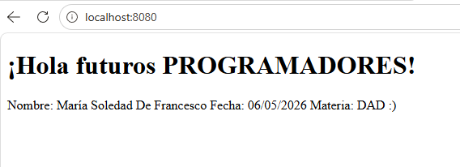
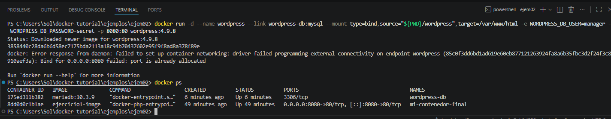
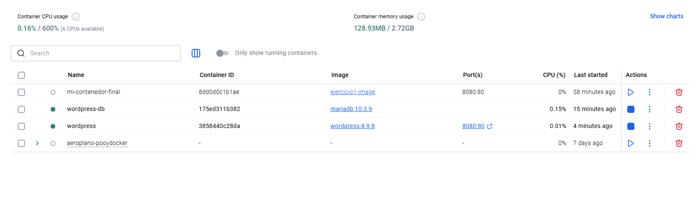
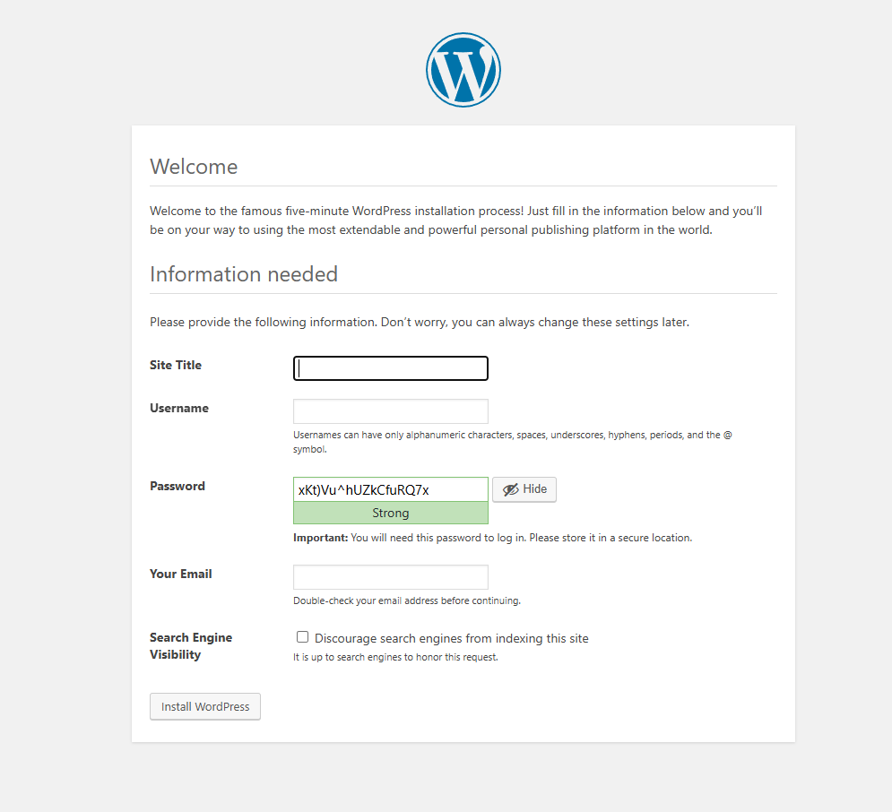

# Ejercicios - Docker
**Estudiante:** Sol De Francesco 
**Carrera:** Programación Full Stack 2° Año
**Materia:** DAD

---

## 🚀 Ejercicio 01: Servidor Web Apache
Configuración de un entorno básico con Dockerfile personalizado y edición remota.

* **Imagen base:** `php:8.2-apache`
* **Herramientas:** Instalación de `vim` para edición interna.
* **Resultado:** Servidor activo en puerto 8080.

### Evidencia Ejercicio 01

---

## 🏗️ Ejercicio 02: WordPress + MariaDB (Multi-Contenedor)
Despliegue de una arquitectura de dos capas con persistencia de datos.

### 🛠️ Tareas Realizadas
* **Base de Datos:** Configuración de un contenedor MariaDB (`10.3.9`) con volúmenes para asegurar que la información no se pierda al apagar el contenedor.
* **Aplicación:** Despliegue de WordPress vinculado a la base de datos mediante `--link`.
* **Sincronización:** Uso de *bind mounts* para vincular la carpeta local del proyecto con el servidor web.

### 📋 Comandos Clave Utilizados
1. `docker run -d --name wordpress-db` (Inicia la base de datos).
2. `docker run -d --name wordpress` (Inicia el sitio web).
3. `docker ps` (Para verificar que ambos círculos estén en verde).

### Evidencia Ejercicio 02

---
*Documentación generada para la materia Programación Web III.*

