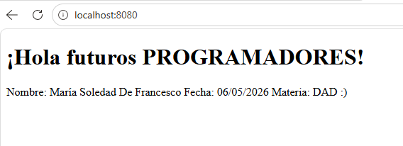
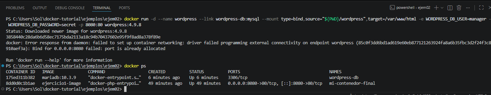
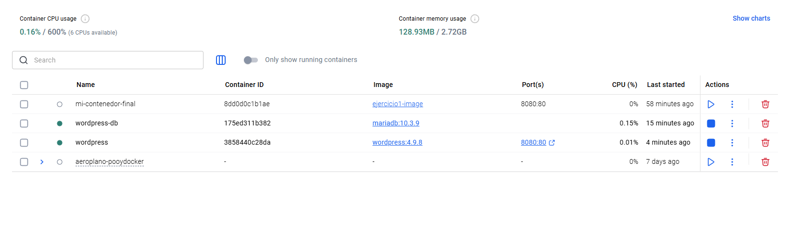
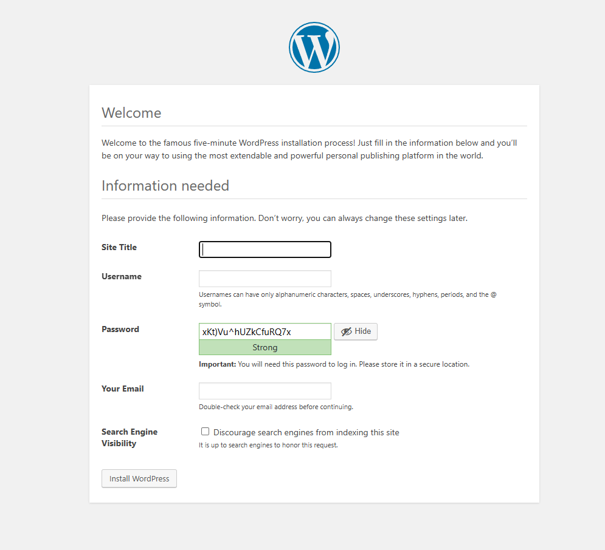
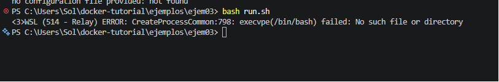
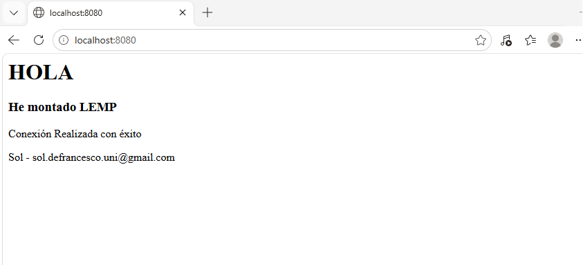

# Ejercicios - Docker
**Estudiante:** Sol De Francesco 
**Carrera:** Programación Full Stack 2° Año
**Materia:** DAD

---

## 🚀 Ejercicio 01: Servidor Web Apache
Configuración de un entorno básico con Dockerfile personalizado y edición remota.

* **Imagen base:** `php:8.2-apache`
* **Herramientas:** Instalación de `vim` para edición interna.
* **Resultado:** Servidor activo en puerto 8080.

### Evidencia Ejercicio 01


---

## 🏗️ Ejercicio 02: WordPress + MariaDB (Multi-Contenedor)
Despliegue de una arquitectura de dos capas con persistencia de datos.

### 🛠️ Tareas Realizadas
* **Base de Datos:** Configuración de un contenedor MariaDB (`10.3.9`) con volúmenes para asegurar que la información no se pierda al apagar el contenedor.
* **Aplicación:** Despliegue de WordPress vinculado a la base de datos mediante `--link`.
* **Sincronización:** Uso de *bind mounts* para vincular la carpeta local del proyecto con el servidor web.

### 📋 Comandos Clave Utilizados
1. `docker run -d --name wordpress-db` (Inicia la base de datos).
2. `docker run -d --name wordpress` (Inicia el sitio web).
3. `docker ps` (Para verificar que ambos círculos estén en verde).

### Evidencia Ejercicio 02






---

# Ejercicio 03: Arquitectura y Despliegue

Este ejercicio analiza las limitaciones de la automatización mediante scripts de Sistema Operativo (Bash) y propone una solución basada en infraestructura declarativa.

## 1. Análisis de inconvenientes (Scripting de S.O.)
Al intentar ejecutar el script `run.sh` originalmente provisto, se encontraron barreras críticas para la portabilidad y la ejecución:

* **Incompatibilidad de plataforma:** El uso de comandos como `chmod` y el intérprete `/bin/bash` generó errores en entornos Windows nativos (`CommandNotFoundException`).
* **Dependencias de entorno:** La ruta definida con `$(pwd)` no es compatible de forma nativa en todos los sistemas operativos, causando fallos de resolución de directorios.


*Figura 1: Error al intentar ejecutar el script de S.O. en PowerShell.*

## 2. Propuesta de Solución: Infraestructura Declarativa
Para resolver la fragilidad del despliegue, se migró la lógica del script hacia un archivo `docker-compose.yml` declarativo. 

### Ventajas de la migración:
1. **Idempotencia:** Docker Compose gestiona el estado de los contenedores, evitando conflictos de nombres o redes.
2. **Portabilidad:** La configuración es agnóstica al sistema operativo del desarrollador.
3. **Gestión de Ciclo de Vida:** Facilita la creación, detención y limpieza de recursos (`docker-compose down`) sin intervenciones manuales.

## 3. Validación del despliegue
Tras corregir la configuración y establecer nombres únicos para los contenedores (prefijo `ejem03-`), el despliegue se completó exitosamente permitiendo la coexistencia con otros ejercicios del repositorio.


*Figura 2: Estado final de los contenedores en Docker Desktop.*

---
**Conclusión:** La transición hacia un despliegue declarativo es esencial en arquitecturas Full Stack para eliminar la deuda técnica que representan los scripts de S.O. y garantizar entornos de desarrollo reproducibles.

---

# Ejecucion Ejem07: Entorno de Desarrollo con Docker

Este proyecto implementa una arquitectura LEMP (Linux, Nginx, MariaDB, PHP) orquestada mediante Docker Compose. El objetivo es proporcionar un entorno de desarrollo consistente, portable y fácil de desplegar.

---
### 📋 Estructura del Proyecto
Plaintext
ejem07/
├── code/          # Código fuente (myapp/index.php)
├── config/        # Archivos de configuración (nginx/default.conf, php)
├── docker/        # Orquestación (docker-compose.yml)
├── logs/          # Logs del servidor Nginx
└── mariadb/       # Persistencia de datos de la base de datos
---
### 🛠️ Cómo ejecutar el proyecto

Para levantar todos los servicios, navega a la carpeta /docker y ejecuta:

```Bash
docker-compose up -d
```
Una vez iniciados, puedes acceder a los servicios en los siguientes puertos:

- **Web App:** [http://localhost:8080](http://localhost:8080)
- **phpMyAdmin:** [http://localhost:8081](http://localhost:8081)
---
### 📸 Evidencias del Funcionamiento

1. Aplicación PHP funcionando


2. Panel de administración

---

### 💡 Notas Técnicas y Desafíos Resueltos
1. Portabilidad: Se configuraron volúmenes mediante rutas relativas en docker-compose.yml, eliminando dependencias de rutas absolutas del host.

2. Networking: Se utilizó una red puente (lemp-network) para asegurar la comunicación interna entre el servidor web, PHP y MariaDB.

3. Persistencia: Se mapeó el directorio /var/lib/mysql para garantizar que los datos de la base de datos no se pierdan al detener los contenedores.

4. Configuración de Servicios:

            -Nginx: Configurado con un bloque de servidor para procesar archivos PHP mediante FastCGI.

            -phpMyAdmin: Configurado mediante variables de entorno (PMA_HOST) para detectar automáticamente el contenedor de la base de datos.

            -MariaDB: Se ajustaron los permisos del usuario root para permitir la comunicación entre contenedores.